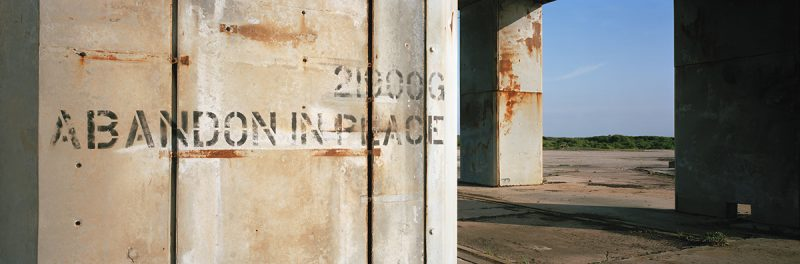

# Sal's Sales
This is the final resting place of the textures, blend files, as well as the application level source for "Sals Pre-owned Spacecraft Sales" parity commercial / site.  No additional work, or PRs, are planned for this repository.  Enjoy!

# Acknowledgements

## Star Fury
There is just no project without the [Star Fury model](https://www.blendswap.com/blends/view/73521), from Chris Kuhn / Kuhn Industries.  The published Blender 2.57 file still loads, but is not really functional. Fortunately, you can append objects from a .blend file into a 3.0 era .blend file.  This rescued that wildly elaborate Geometry from clutches of time.

The materials just needed to be tossed, though.  Time had not been kind to them.  Modern PBR materials were fashioned as a replacement.  The mesh breakout, parent child relationships, and mesh origins needed to be reorganized in order to be able to open / close the hatch, and animate those fin things in the back.

Notes:  
-	The fins are in the .blend file at their maximum rotation.
-	No Triangles were removed or otherwise harmed in the process.

## Space Texture
This texture came from Hdrlabs with the creators being Blochi using data from NASA.  The closest to a url is [http://www.hdrlabs.com/sibl/archive.html](http://www.hdrlabs.com/sibl/archive.html).  Look for the Milkyway.  As this is a very large texture, I converted to ASTC format.  May help frame rate performace of older devices like Quest 1.

## Audio
Got portions of sounds for the firing of weapons and the engine sound.

- Firing sound came from "[Scifi Laser Gun Firing](https://freesound.org/s/495054/)" by [TannerSound](https://freesound.org/people/TannerSound/).
- Engine sound came from "[Spaceship Ambience](https://freesound.org/s/234316/)" by [nick121087](https://freesound.org/people/nick121087/).
- Ding sound came from "[Elevator_Ping_01](https://freesound.org/s/459349/)" by [MATRIXXX_](https://freesound.org/people/MATRIXXX_/).

# License(s)
In a aggregation type project, things are mix of licenses:
- The Babylon JS files are not directly in this repository, but it is Apache 2.0
- The Star Fury is CC-BY.  I am not storing the original, but both my modified .blend & original are CC-BY.
- The space texture is CC-BY.  The converted ASTC formatted file is CC-BY as well.
- The audio files are all CC-BY.
- Anything else is Copyright © 2022 Jeffrey Palmer (MIT License)